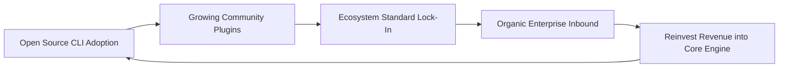

# business-strategy

## Core Philosophy
Business strategy is not operational efficiency, brainstorming long wishlists of features, or chasing every competitor announcement. As Michael Porter defined: **"Strategy is making trade-offs in competing. The essence of strategy is choosing what NOT to do."** True business strategy is the deliberate choice of a differentiated system of activities that delivers unique value to a defined market segment while establishing sustainable structural moats that competitors cannot easily copy.

---

## 4-Step Strategic Formulation Framework

### Step 1: Competitive Advantage & Moat Analysis (Hamilton Helmer's 7 Powers)
1. **The 7 Structural Powers**:
   - *1. Scale Economies*: Unit costs decline as volume increases (e.g. AWS amortizing data center fiber).
   - *2. Network Effects*: Product value increases with each new user (e.g. GitHub, Figma).
   - *3. Counter-Positioning*: A newcomer adopts a novel business model that the incumbent cannot copy without cannibalizing their existing core business (e.g. Netflix streaming vs Blockbuster retail stores; Flat-rate SaaS vs usage billing).
   - *4. Switching Costs*: The financial, operational, or psychological pain of ripping out the product exceeds the marginal benefits of switching.
   - *5. Branding*: An objective premium earned through long-standing emotional trust.
   - *6. Cornered Resource*: Preferential access to scarce assets (e.g. unique patents, key technical talent).
   - *7. Process Power*: Embedded organizational muscle memory and proprietary workflows built over years (e.g. Toyota Production System).

### Step 2: The Strategic Trade-Off & Non-Goals Mandate
1. **The Trade-Off Acid Test**:
   - If a strategic priority does not have a viable, logical alternative that another successful company chooses, it is not a strategy—it is a platitude (e.g. "Delivering high quality software" is not a strategy; "Sacrificing custom enterprise requests to prioritize self-serve developer speed" is a strategy).
2. **Documenting What You Will NOT Do**:
   - Explicitly define the customer segments you refuse to serve, the features you will never build, and the revenue opportunities you will deliberately turn away.

### Step 3: Market Entry Wedge & Flywheel Dynamics
1. **The Beachhead Wedge Strategy**:
   - Dominate a tiny, underserved niche before expanding into adjacent markets (e.g. Amazon starting exclusively with physical books; PayPal starting exclusively with eBay power sellers).
2. **The Compounding Growth Flywheel**:
   - Map the self-reinforcing causal loop:
     $$text{More Devs Adopt CLI}  o text{More Community Integrations}  o text{Stronger Ecosystem}  o text{Lower Acquisition Cost}  o text{More Devs Adopt}$$

### Step 4: Strategic Horizons & Execution Governance (Three Horizons)
1. **Horizon 1 (Current Core - 70% Resources)**: Defend and scale existing cash cows.
2. **Horizon 2 (Emerging Engines - 20% Resources)**: Fast-growing adjacent product bets.
3. **Horizon 3 (Transformative Options - 10% Resources)**: Moonshots and frontier R&D.

---

## Deliverable Format: Strategic Thesis & Moat Memo (`STRATEGY-MEMO.md`)

```markdown
# Strategic Direction & Competitive Moat Memorandum: [Company Name]

## 1. Core Strategic Position & Value Proposition
- **Strategic Category**: [Defined market position]
- **Target Wedge**: [Hyper-specific beachhead market segment]
- **Value Thesis**: [How we win against alternatives]

## 2. Competitive Moat Analysis (7 Powers Audit)
- **Primary Power**: **Counter-Positioning**
  - *Mechanism*: Our open-source local-first model allows developers to run all tests offline for free. The legacy cloud incumbent cannot copy this without cannibalizing their $80M/year cloud compute credit billing model.
- **Secondary Power**: **Switching Costs**
  - *Mechanism*: Automated schema configuration and compliance policy engines embedded deep inside customer CI/CD pipelines.

## 3. Explicit Non-Goals (What We Will NOT Do)
1. We will NOT build custom one-off features for enterprise customers.
2. We will NOT pursue on-premise air-gapped defense contracts in v1.
3. We will NOT engage in aggressive outbound cold-calling sales.

## 4. The Self-Reinforcing Strategic Flywheel

```

---

## Worked Example: Developer Tool Counter-Positioning Strategy

- **Incumbent**: Proprietary enterprise cloud vendor charging per-minute compute and seat fees.
- **Challenger Strategy**: Launched open-core CLI executing 100% locally on developer hardware for $0.
- **Result**: Incumbent could not respond without destroying their public revenue guidance; challenger captured 40% market share of new cloud startups in 18 months.

---

## Verification Checklist

- [ ] Strategy defines an unambiguous differentiated position (not just operational efficiency).
- [ ] At least one durable structural moat (Helmer's 7 Powers) is engineered.
- [ ] Explicit non-goals identify customers and revenue streams the company turns away.
- [ ] Self-reinforcing growth flywheel dynamic is modeled.
- [ ] Strategic trade-offs pass the acid test (the opposite choice is a viable strategy).

---

## Anti-Patterns

- **Strategy as Wishful Thinking**: Defining strategy as "We will be #1 in the market by growing 200%".
- **Being Everything to Everyone**: Trying to serve enterprise banks and solo indie hackers simultaneously.
- **Ignoring Competitor Retaliation**: Assuming incumbents will sit passively while you attack their core profit center.
