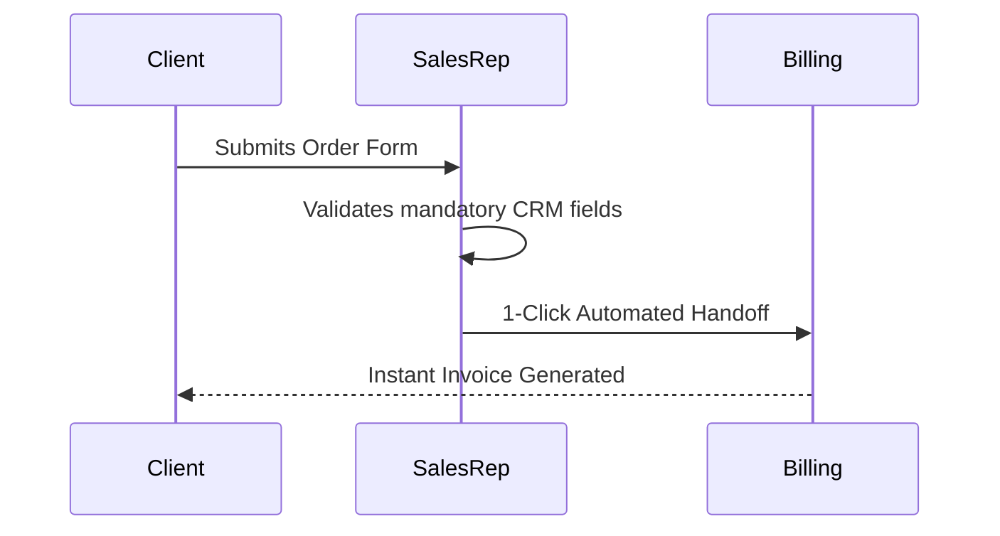

# process-redesign

## Core Philosophy
Pasting automated software workflows onto a broken, inefficient business process simply creates high-speed automated chaos. As the Lean manufacturing adage warns: **"Automating an inefficient process amplifies its inefficiencies."** Process redesign is the surgical deconstruction of operational workflows. It requires mapping the current reality, ruthlessly eliminating the 8 Lean wastes (Muda), identifying root causes via the 5 Whys, and streamlining the manual process before writing a single line of automation code.

---

## 4-Step Lean Process Redesign Framework

### Step 1: Current-State Value Stream Mapping (VSM)
1. **Walk the Real Process (The Gemba Walk)**:
   - Never rely on executive memory or outdated handbook diagrams. Shadow the actual front-line operators executing the daily work.
2. **Map the 3 Critical Time Metrics**:
   - *Process Time ($PT$)*: The actual time an operator is actively working on the task (e.g. 15 minutes drafting an invoice).
   - *Wait / Queue Time ($WT$)*: The dead time the work sits idle waiting for approval, review, or response (e.g. 4 days waiting for manager sign-off).
   - *Lead Time ($LT$)*: Total elapsed time from initiation to final completion ($LT = PT + WT$).
   - *Process Cycle Efficiency (PCE)*:
     $$PCE = rac{\sum PT}{text{Total } LT}  imes 100\%$$
     - In bloated corporate processes, PCE is frequently $< 5\%$.

### Step 2: The 8 Lean Wastes Audit (DOWNTIME)
1. **Audit for the 8 Classical Wastes**:
   - **D**efects: Broken data, rework, typos, corrupted customer records.
   - **O**verproduction: Generating reports that nobody reads.
   - **W**aiting: Bottlenecks waiting for manual multi-tier executive signatures.
   - **N**on-Utilized Talent: Senior engineers manually copy-pasting CSV rows.
   - **T**ransportation: Bouncing support tickets across 4 departments before diagnosis.
   - **I**nventory: Backlog of 400 unassigned, stagnant tickets.
   - **M**otion: Switching between 6 SaaS tabs to find one customer record.
   - **E**xtra-Processing: Double-data entry across Salesforce and Excel.

### Step 3: Root-Cause Investigation (The 5 Whys & Ishikawa)
1. **The 5 Whys Discipline**:
   - Drill past superficial symptoms to find the systemic failure:
     - *Problem*: Invoices are consistently delayed by 10 days.
     - *Why?* Sales reps enter incomplete billing metadata.
     - *Why?* The CRM form has 40 unvalidated optional fields.
     - *Why?* Sales reps bypass fields to hit sprint demo quotas.
     - *Why?* The incentive structure rewards demo creation over deal data hygiene.
     - *Root Cause*: Misaligned SDR compensation incentives and unvalidated CRM inputs.

### Step 4: Future-State Architecture & Friction Elimination
1. **The ECRS Optimization Hierarchy**:
   - **E**liminate: Delete the step entirely. If a report has no readers, kill it.
   - **C**ombine: Merge multiple disparate review steps into a single review station.
   - **R**eorder: Parallelize sequential tasks where dependencies do not exist.
   - **S**implify: Streamline the remaining manual steps before applying automation.

---

## Deliverable Format: Process Redesign Blueprint (`PROCESS-REDESIGN.md`)

```markdown
# Process Redesign Blueprint: [Workflow Name]
*Process Owner: [Name, Title] | Target Lead Time Reduction: 60%*

## 1. Current State vs Future State Metrics
| Metric | Current State | Future State (Target) | Delta (%) |
|---|---|---|---|
| Total Lead Time ($LT$) | 14 Days | 3 Days | **-78.5%** |
| Active Process Time ($PT$)| 4.5 Hours | 1.2 Hours | **-73.3%** |
| Hand-off Count | 6 hand-offs | 2 hand-offs | **-66.7%** |
| Process Cycle Efficiency | 4.0% | 16.7% | **+317%** |

## 2. Waste Identification & Elimination Plan
- **Waste #1 (Waiting)**: Invoices stalled 5 days waiting for CFO signature on deals < $10k.
  - *Fix*: Empower Department Managers to sign deals up to $25k; eliminate CFO gate.
- **Waste #2 (Extra-Processing)**: Manual re-entry of client data from PandaDoc into HubSpot.
  - *Fix*: Standardize fields; eliminate double entry.

## 3. Future-State Swimlane Workflow

```

---

## Worked Example: Software Deployment Request Redesign

- **Problem**: Developers took 12 days to get approval for a new staging cloud environment across 5 approval committees.
- **Lean Redesign**: Eliminated 3 manual approval gates; consolidated security and network validation into an automated policy engine.
- **Outcome**: Staging environment provisioning lead time dropped from 12 days to 8 minutes.

---

## Verification Checklist

- [ ] Current-state process mapped through direct observation (Gemba walk).
- [ ] Process Time, Wait Time, and Lead Time mathematically calculated.
- [ ] All 8 Lean wastes (DOWNTIME) audited across the workflow.
- [ ] Root cause identified via 5 Whys analysis before designing the solution.
- [ ] Elimination and simplification executed before adding software automation.

---

## Anti-Patterns

- **Automating the Mess**: Building a complex Zapier/Python bot to automate a broken, unnecessary spreadsheet workflow.
- **Armchair Mapping**: Drafting a process map in a boardroom without ever watching the employees who actually do the work.
- **Adding More Gates**: Responding to an operational mistake by adding 3 more layers of managerial review.
